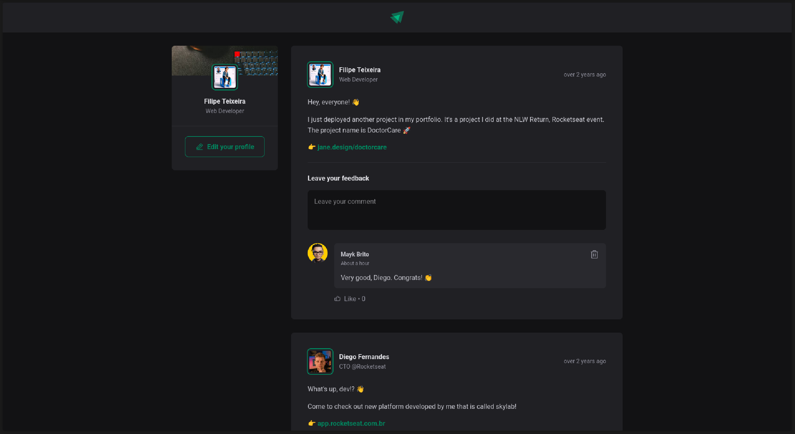

<p align="center" >
  
</p>
<h1 align="center"> Ignite Feed </h1>

<p align="center">
  
  
  
  
  
  
  
</p>

<p align="center">
  <a href="#-technologies">Technologies</a>&nbsp;&nbsp;&nbsp;|&nbsp;&nbsp;&nbsp;
  <a href="#-project">Project</a>&nbsp;&nbsp;&nbsp;|&nbsp;&nbsp;&nbsp;
  <a href="#-layout">Layout</a>&nbsp;&nbsp;&nbsp;|&nbsp;&nbsp;&nbsp;
  <a href="#-license">License</a>
</p>

<p align="center">
  
</p>

<br>

<p align="center">
  
</p>

## 🚀 Technologies

This project was developed with the following technologies:

- JavaScript
- React
- Vite
- CSS Modules
- date-fns
- Phosphor Icons
- Git e Github

## 💻 Project

This repository hosts an application that is similar to a social media feed. It is built using React and Vite, showcasing the use of components, state management, and styling with CSS Modules. The application features a user interface where users can view existing posts and interact with them through comments. It also includes functionalities such as displaying the time since each post was created using the date-fns library.

## 💻 How to run

```bash
# Clone the repository
git clone https://github.com/filipebteixeira98/ignite-feed.git

# Access the project folder
cd ignite-feed

# Install the dependencies
npm install

# Run the project
npm run dev
# The project will be available at http://localhost:3000
```

## 📝 License

This project is under the MIT license.

<p align="center">
  Made with ♥ by me
</p>
